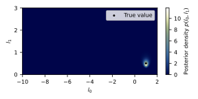

==========
Quickstart
==========

Suppose you had the following data set for which you wanted to perform a
Bayesian analysis of the log-normal distribution:

.. code :: python

   import numpy as np
   # Log-normally-distributed random values with l0=1.0, l1=0.5:
   N = np.array([1.10556883, 5.07527308, 2.60603815, 3.76415609,
                 4.14403281, 3.82246619, 3.62519342, 1.5404973 ,
                 2.29341138, 2.69632835, 1.47836845, 2.47652787,
                 4.51722975])

The data is synthetically generated from a log-normal distribution with
:math:`l_0=1` and :math:`l_1=\frac{1}{2}`. Its histogram looks as follows:

Now define a :py:class:`~pybalonor.FlatPrior` instance within the ranges
:math:`-10\leq l_0 \leq 2` and :math:`0 \leq l_1 \leq 3`:

.. code :: python

   from pybalonor import Posterior, FlatPrior
   L0_MIN = -10.0
   L0_MAX = 2.0
   L1_MIN = 0.0
   L1_MAX = 3.0
   prior = FlatPrior(L0_MIN, L0_MAX, L1_MIN, L1_MAX)

With this prior and the previously defined sample, the
:py:class:`~pybalonor.Posterior` can be computed:

.. code :: python

   posterior = Posterior(N, prior)

Posterior density
"""""""""""""""""

The posterior distribution in :math:`l_0` and :math:`l_1` is computed using
the posterior's :py:meth:`~pybalonor.Posterior.density` method:

.. code :: python

   l0 = np.linspace(L0_MIN, L0_MAX, 500)
   l1 = np.linspace(L1_MIN, L1_MAX, 201)
   p = posterior.density(*np.meshgrid(l0, l1))

The :py:meth:`~pybalonor.Posterior.log_density` method can resolve values far
off the peak:

.. code :: python

   lp = posterior.log_density(*np.meshgrid(l0, l1))

Posterior predictive
""""""""""""""""""""
Similarly, the posterior predictive distribution in :math:`x` can be computed
using either of the :py:meth:`~pybalonor.Posterior.log_predictive_pdf`,
:py:meth:`~pybalonor.Posterior.predictive_pdf`,
:py:meth:`~pybalonor.Posterior.predictive_cdf`,
:py:meth:`~pybalonor.Posterior.predictive_ccdf`,
:py:meth:`~pybalonor.Posterior.predictive_quantiles`, or
:py:meth:`~pybalonor.Posterior.predictive_tail_quantiles` methods:

.. code :: python

   x = np.linspace(0.0, 15.0, 100)
   y = posterior.predictive_cdf(x)

Posterior of the mean
"""""""""""""""""""""
The posterior of the distribution's mean :math:`\mu` can be evaluated using
either of :py:meth:`~pybalonor.Posterior.log_mean_pdf` or
:py:meth:`~pybalonor.Posterior.mean_pdf`

.. code :: python

   mu = np.geomspace(mu_min, mu_max, 10000)
   posterior = Posterior(N, prior)
   y = posterior.mean_pdf(mu)

